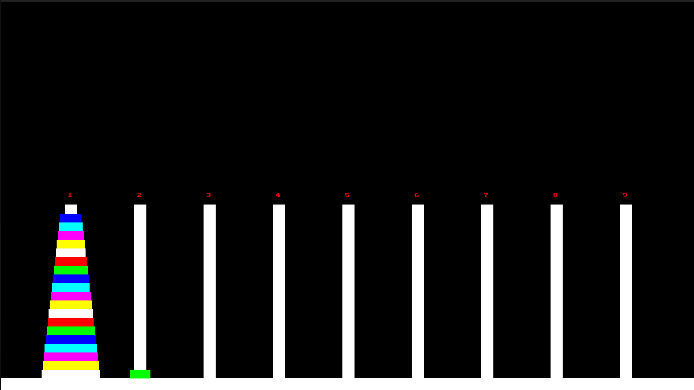
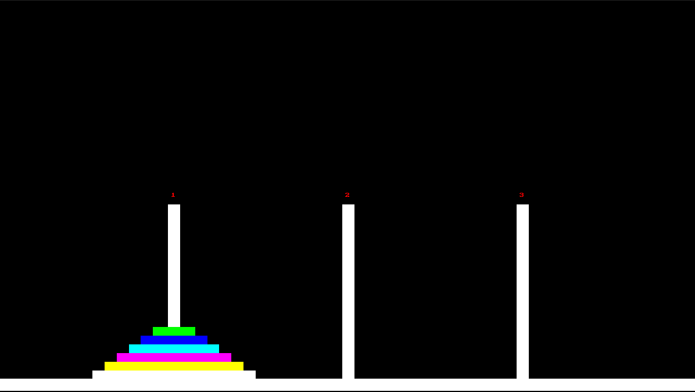
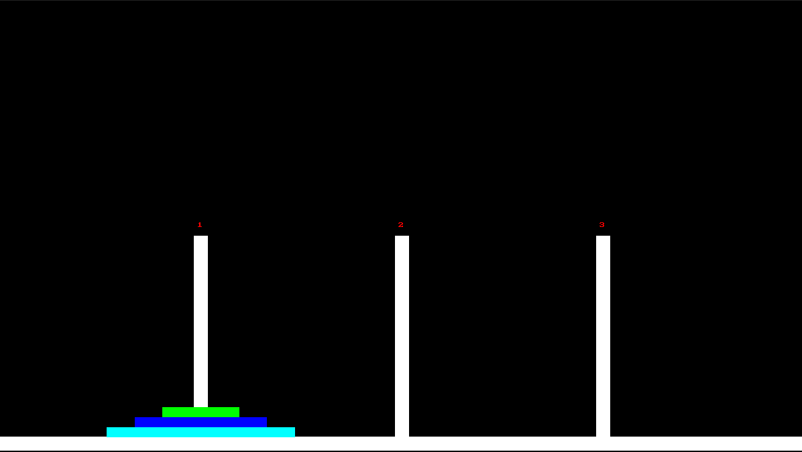
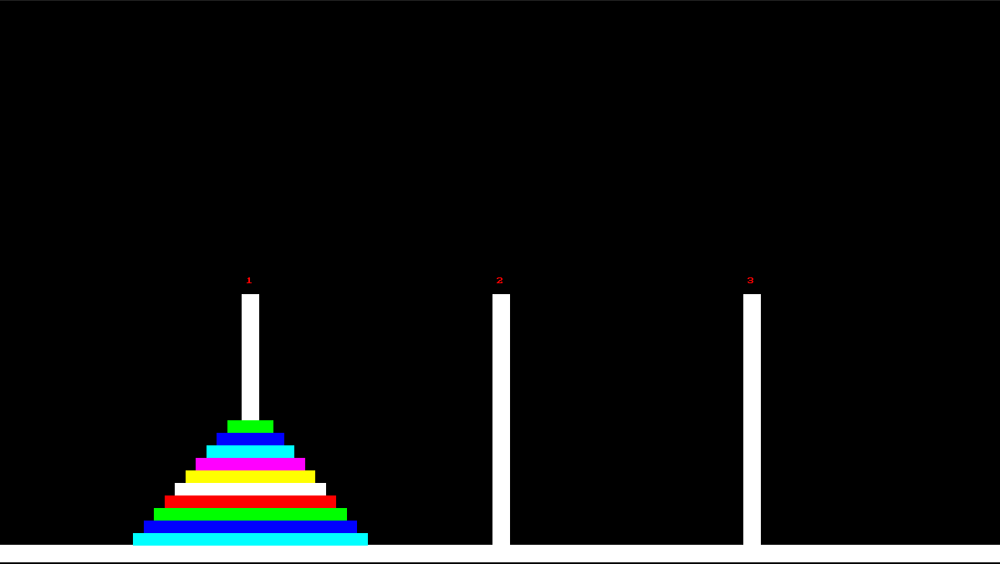
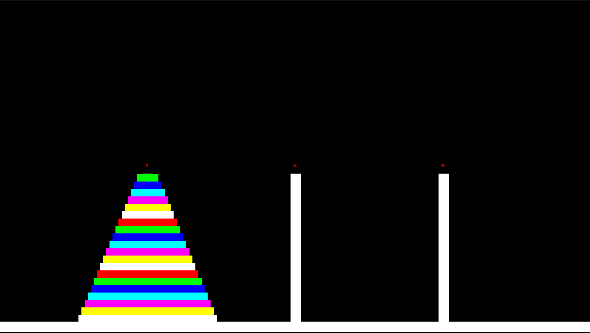
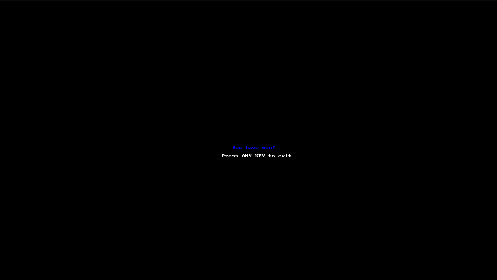

## 🎮 Controls

| Key | Action |
|-----|--------|
| `1–9` | Select rods (first press = origin rod, second press = destination rod) |
| `0` | Select rod number 10 (only if NUMBER_OF_RODS == 10) |
| `r` | Reset current rod selection |
| `Esc` | Exit the game |

To move a disk: 
Press the number of the **origin rod**, then the number of the **destination rod**. 
Example: `1`, then `3` moves the top disk from rod 1 to rod 3.

If you make a mistake while selecting the origin rod or want to start your selection over,
press **`r`** - it clears the current choice so you can select a new origin rod.

---

## 📸 Gallery

  
  

  
  

  
  

